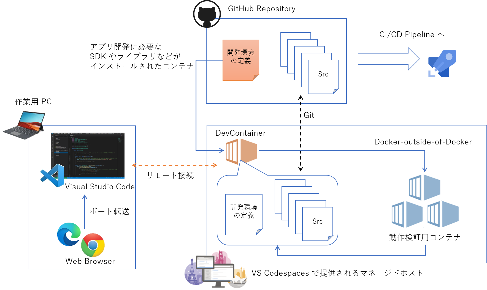
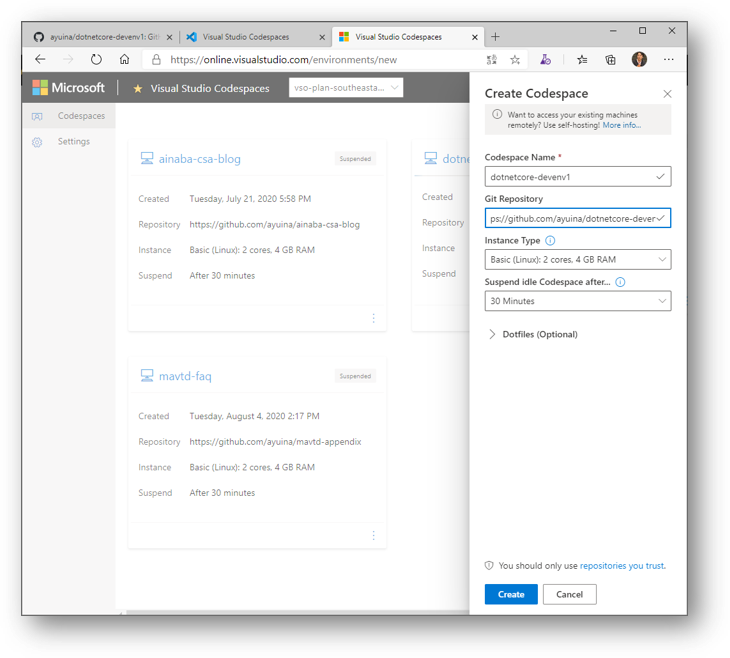
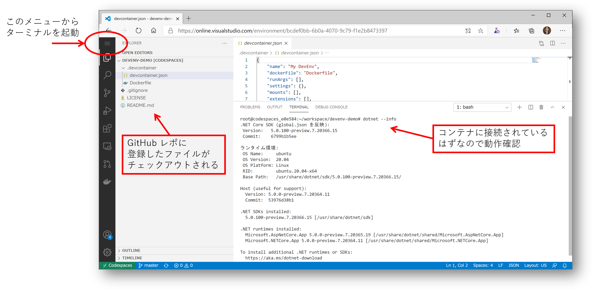
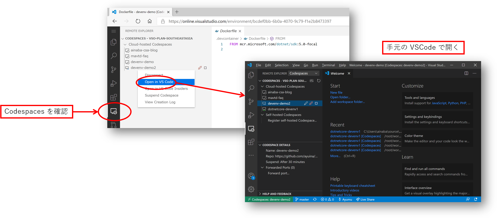
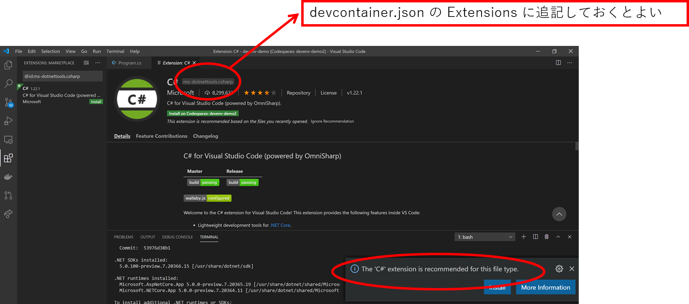
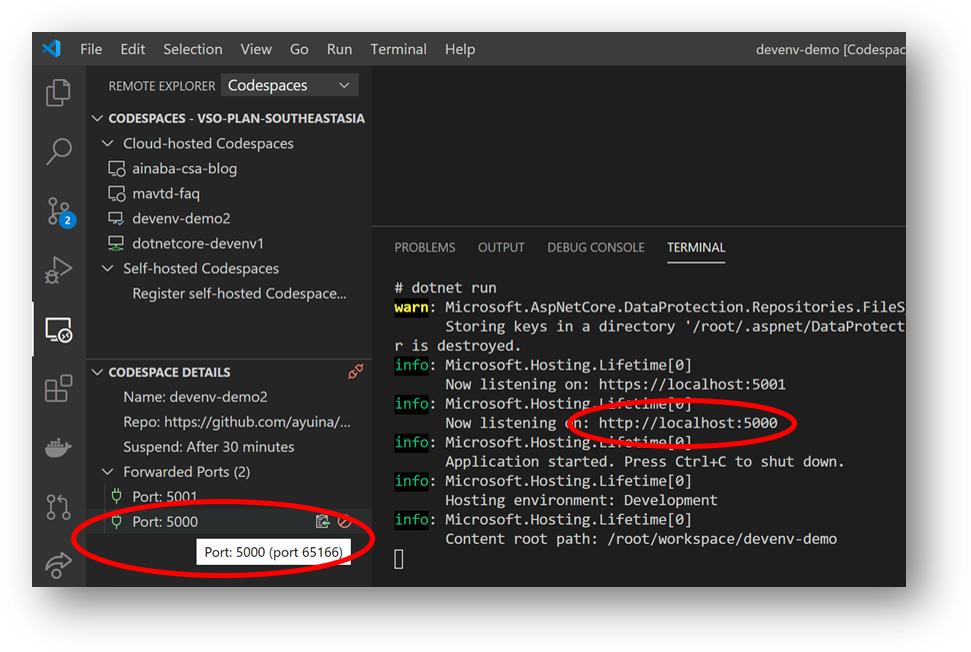
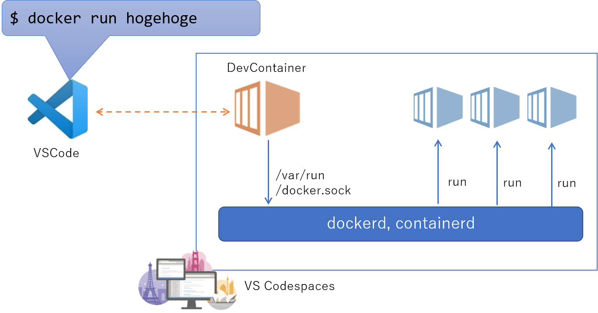
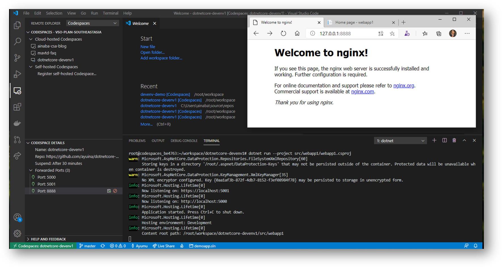

# Visusl Studio Codespaces とコンテナ技術を活用したリモート開発

GitHub、VS Code、VS Codespaces、Azure WebApp を利用した ASP.NET Core アプリ開発環境の構築手法を紹介します。

## はじめに

古来より開発者が作成したソースコードはソースコードレポジトリで管理され、他の開発者と共有・保守されてきました。
そしてそのソースコードの作成や実行には様々なライブラリ・SDK・ツールが必要で、そのバージョン管理には頭を悩ませてきました。
ソフトウェアの開発環境をドキュメントで標準化しても、時間がたつにつれて様々な要因から統制が難しくなってきます。

現代ではコンテナ技術が普及し、多種多様な環境でも全く同じソフトウェア構成を再現することが容易になりました。
コンテナ技術を利用することでアプリケーションの可搬性（ポータビリティ）を向上させることができますが、
これは前述の開発環境で発生しがちなソフトウェア構成管理の問題の解決に役立てることも可能です。

## アプローチ

本ドキュメントで紹介する環境の概要は以下のようになります。



- Github でアプリのソースコードだけでなく開発環境の構成定義を管理する
- Visual Studio Codespaces で用意した環境にコンテナをデプロイ
- コンテナ内にアプリのソースコードをチェックアウト
- 作業用マシンにインストールされた Visual Studio Code から接続
- 作成したコードは Codespace 内で接続した（あるいは新規の）コンテナ内で動作確認
- 作業が完了したコードは Github に書き戻す

実は技術的な観点でいえば必ずしも Visual Studio Codespaces は必要ではなく、まったく同じ方法でコンテナを作業用 PC 上で動作させることは可能です。
しかしその場合、各作業用 PC を操作する開発者がある程度コンテナ技術に詳しくなる必要がありますし、コンテナを多数動かす場合には要求スペックも高くなってきます。
開発規模が大きくなり開発者の人数が増えるほど、作業用 PC のスペックや環境の統制が難しくなり、この問題は大きくなってきます。
このため任意のタイミングでスケールが調整できるクラウドも合わせて活用することをお勧めします。

## 開発環境を配布するためのフレームワーク

まず初めに GitHub リポジトリを用意してしまいましょう。
これはチームのリーダーなどが代表で実施することになります。

リポジトリを用意したらファイルを２つ作成します。

- {repositoryRoot}/.devcontainer/Dockerfile
- {repositoryRoot}/.devcontainer/devcontainer.json

`Dockerfile` では開発環境で利用するソフトウェアがインストールされたコンテナを作成します。
例えば .NET 5 ベースのアプリケーションを開発したい場合は、
[インストーラをダウンロードしてインストールする処理](https://dotnet.microsoft.com/download)
を Dockerfile に書いてもよいですが、SDK がインストール済みの
[コンテナイメージも配布されている](https://hub.docker.com/_/microsoft-dotnet-sdk/)
のでそちらを使ってしまったほうが便利です。

```Dockerfile
FROM mcr.microsoft.com/dotnet/sdk:5.0-focal
```
本記事の作成時点での最新版である Ubuntu 20.04 に .NET 5 preview 7 がインストールされているコンテナイメージをベースに、何もカスタマイズしていない状態です。
開発作業が進むにつれて、これだけでは不足することは間違いありませんが、それは必要になったタイミングで Dockerfile に追記すればいいのです。

なお Git だけは必ずインストールしておくことをお勧めします。
この先はこの開発環境を使ってソースコードを開発していくことになるわけですので、Git がないとリポジトリに反映することができません。 
使用する際に毎度インストールするのは手間なので、Dockerfile に記載してしまったほうが良いでしょう。
（上記の Dockerfile には明示的な記載がありませんが、ベースイメージでインストールされています）

そして、この Dockerfile から作られるコンテナイメージをホストする環境の定義をもう１つの `devcontainer.json` に書いていきます。こちらも
[いろいろなオプションが指定できます](https://docs.microsoft.com/ja-jp/visualstudio/codespaces/reference/configuring)が、
まずは必要最低限だけを記載して必要になったものは後から追加することにします。

```json
{
    "name": "ASP.NET Core DevEnv1",
    "dockerFile": "Dockerfile",
    "runArgs": [],
    "settings": {
        "terminal.integrated.shell.linux": "/bin/bash"
    },
    "mounts": [],
    "extensions": [],
    "forwardPorts":[],
    "postCreateCommand": ""
}
```

- 開発環境の名前を付けて
- ソフトウェア構成が Dockerfile に従うことを指定して
- ターミナル接続した際には Bash を使用する

これらの２つのファイルをリポジトリに登録したら準備完了です。


## Visual Studio Codespaces へ開発コンテナを配置する

ここからは開発者個人の作業になります。
各自が保有する Azure サブスクリプションを利用して
[Visual Studio Codespaces](https://online.visualstudio.com) を有効化し、
先ほど定義した開発コンテナをホストする Codespace を作成します。



- Codespace の名前は適当に付けて大丈夫です（どうせ後で何度も作り直します）
- Git Repository には先ほど作成した GitHub リポジトリの URL を入力します
- Instance Type はこちらもとりあえず Basic でいいでしょう（スペックが足りなくなれば後で増強できます）

作成すると登録した `Dockerfile` を元にコンテナイメージが作成され、GitHub リポジトリの中身がクローンされた状態のワークスペースに接続します。
Web ブラウザ内に Visual Studio Code が表示されていますので、引き続きこの中で作業を行っていきます。



ターミナルを起動してインストールされた .NET のバージョンなどを確認してみましょう。

```bash
$ dotnet --info

.NET SDK (reflecting any global.json):
 Version:   5.0.100-preview.7.20366.15
 Commit:    6799b1b5ee

Runtime Environment:
 OS Name:     ubuntu
 OS Version:  20.04
 OS Platform: Linux
 RID:         ubuntu.20.04-x64
 Base Path:   /usr/share/dotnet/sdk/5.0.100-preview.7.20366.15/

Host (useful for support):
  Version: 5.0.0-preview.7.20364.11
  Commit:  53976d38b1

.NET SDKs installed:
  5.0.100-preview.7.20366.15 [/usr/share/dotnet/sdk]

.NET runtimes installed:
  Microsoft.AspNetCore.App 5.0.0-preview.7.20365.19 [/usr/share/dotnet/shared/Microsoft.AspNetCore.App]
  Microsoft.NETCore.App 5.0.0-preview.7.20364.11 [/usr/share/dotnet/shared/Microsoft.NETCore.App]
```

ここで指定したものと違う .NET Core のバージョンが表示された場合には、コンテナの起動や接続に失敗している可能性があります。
`Dockerfile` や `devcontainer.json` の内容を見直して修正してもそのままでは反映されませんので、リポジトリに Push してから Codespace を破棄して新規に作り直してください。


## Visual Studio Code から接続する

Web ブラウザで Visual Studio Code が表示されているのでそのまま開発作業に入ってしまってもいいのですが、やはり IDE はローカルのものを使ったほうが作業はやりやすいと思います。

Visual Sduio Code に
[Codespaces に接続するための Extension ](https://marketplace.visualstudio.com/items?itemName=MS-vsonline.vsonline) 
をインストールしておいて、
ブラウザ版のメニューから __VS Codeで開く__ を選択すれば自動的に接続してくれます。




## アプリケーションの開発

ここからは実際に ASP.NET Core Web アプリケーションを開発してみましょう。
VSCode のターミナルを起動して下記のコマンドを実行すると、テンプレートプロジェクトが生成されます。

```bash
$ dotnet new webapp
```

テンプレートプロジェクトに含まれる C# のソースコードを適当に開いてみると、
Extension のインストールを勧められると思います。



これをインストールしつつ `devcontainer.json` ファイルに追記しておきましょう。
次回コンテナイメージが再生成される際に自動的に Extension がインストールされるようになります。

```json
{
    "name": "ASP.NET Core DevEnv1",
    "dockerFile": "Dockerfile",
    "settings": {
        "terminal.integrated.shell.linux": "/bin/bash"
    },
    "extensions": [
      "ms-dotnettools.csharp",
    ]
}
```

さて開発したアプリケーションを実行してみましょう。

```bash
$ dotnet run

warn: Microsoft.AspNetCore.DataProtection.Repositories.FileSystemXmlRepository[60]
      Storing keys in a directory '/root/.aspnet/DataProtection-Keys' that may not be persisted outside of the container. Protected data will be unavailable when container is destroyed.
info: Microsoft.Hosting.Lifetime[0]
      Now listening on: https://localhost:5001
info: Microsoft.Hosting.Lifetime[0]
      Now listening on: http://localhost:5000
info: Microsoft.Hosting.Lifetime[0]
      Application started. Press Ctrl+C to shut down.
info: Microsoft.Hosting.Lifetime[0]
      Hosting environment: Development
info: Microsoft.Hosting.Lifetime[0]
      Content root path: /root/workspace/devenv-demo
```

おそらく初期状態であればポート 5000 と 5001 で Listen するはずです。
ここままではクラウド上の Codespaces で動作しているコンテナが開けているポートなのでアクセスできません。 
しかし Visual Studio Code が自動的にポートフォワードしてくれます。



これによれば [localhost:65166](http://localhost:65166) にアクセスすれば
コンテナのポート5000 に転送してくれるはずですので、ブラウザからアクセスすれば Web アプリケーションの動作確認が可能です。
とはいえ毎回ポート番号を確認するのは手間ですので、これも `devcontainer.json` の `forwardPorts` で指定してしまいましょう。

```json
{
    "name": "ASP.NET Core DevEnv1",
    "dockerFile": "Dockerfile",
    "settings": {
        "terminal.integrated.shell.linux": "/bin/bash"
    },
    "extensions": [
      "ms-dotnettools.csharp",
    ],
    "forwardPorts":[5000, 5001],
    "postCreateCommand": "dotnet restore"
}
```

また上記では `postCreateCommand` で開発コンテナ生成後に必ず実施する処理として、依存ライブラリのリストア処理を記載しています。
だいぶ開発環境が整ってきました。


## 外部コンテナの起動

アプリケーションの開発が進むと、依存するサービス（API とか Database とか Cache とか）と接続した動作確認もしたくなってきますよね。
開発コンテナにそれらの外部サービスもインストールしてしまうというのも１つの考え方ですが、コンテナイメージも大きくなってしまいますし、全ての開発者が利用するコンテナイメージを安易に汚したくはありません。
同じ理由で開発コンテナの中に Docker を入れる（Docker-in-Docker）というのもいまいちですね。
となれば開発コンテナの外に動作させる Docker-outside-of-Docker を使うのがよさそうです。



これを実現するためには下記の作業が必要になります。

- 開発コンテナ内に Docker CLI をインストールしておく（Dockerfile に記載）
- ホストコンテナの /var/run/docker.sock を開発コンテナにマウントする（devcontainer.json に記載）

Docker CLI のインストールには
[本家](https://docs.docker.com/engine/install/ubuntu/)を参照するのが良いと思います。

実際の Dockerfile は下記のようになりました。

```Dockerfile
FROM mcr.microsoft.com/dotnet/sdk:5.0-focal

RUN apt-get update -yq \
    # Install Docker CLI
    && apt-get install -yq apt-transport-https ca-certificates curl gnupg-agent software-properties-common lsb-release unzip \
    && curl -fsSL https://download.docker.com/linux/ubuntu/gpg | apt-key add - \
    && add-apt-repository "deb [arch=amd64] https://download.docker.com/linux/ubuntu $(lsb_release -cs) stable" \
    && apt-get update \
    && apt-get install -yq docker-ce-cli
```

また `devcontainer.json` の `mounts` は下記のようになります。

```json
{
    "name": "ASP.NET Core DevEnv1",
    "dockerFile": "Dockerfile",
    "runArgs": [],
    "settings": {
        "terminal.integrated.shell.linux": "/bin/bash"
    },
    "mounts": [
      "source=/var/run/docker.sock,target=/var/run/docker.sock,type=bind"
    ],
    "extensions": [
      "ms-dotnettools.csharp",
    ],
    "forwardPorts":[5000, 5001],
    "postCreateCommand": "dotnet restore src/demoapp.sln"
}
```

この状態で Codespace を一度作り直してから VSCode を接続すると、開発コンテナのターミナルからホスト上で動作している全てのコンテナを操作することが可能です。
まず現在実行している開発コンテナ（＝自分自身）を確認してみると、ホスト名とコンテナ名が一致しているので、VSCode から接続しているのが当該コンテナであることがわかります。

```bash
$ hostname
codespaces_c772b8

$ docker ps -a
CONTAINER ID        IMAGE               COMMAND                  CREATED             STATUS              PORTS               NAMES
4719de8b1073        cloudenvimage       "/bin/sh -c 'while s…"   3 hours ago         Up 3 hours                              codespaces_c772b8
```

では外部のコンテナを起動してみましょう。
開発コンテナと並行して起動していることがわかります。

```bash
$ docker run -d -p 8888:80 nginx

$ docker ps -a
CONTAINER ID        IMAGE               COMMAND                  CREATED             STATUS              PORTS                  NAMES
54f041ecc9df        nginx               "/docker-entrypoint.…"   2 minutes ago       Up 2 minutes        0.0.0.0:8888->80/tcp   musing_tharp
4719de8b1073        cloudenvimage       "/bin/sh -c 'while s…"   3 hours ago         Up 3 hours                                 codespaces_c772b8

$ curl http://localhost:8888
<html>
<head>
<title>Welcome to nginx!</title>
<style>
  ...

```

なおこのポート 8888 もフォワードしてしまえば開発端末から localhost 経由でアクセスできるようになります。



## 参考情報

- [Configureing environments](https://docs.microsoft.com/ja-jp/visualstudio/codespaces/reference/configuring)
- [devcontainer.json reference](https://code.visualstudio.com/docs/remote/devcontainerjson-reference)

## 補足

上記では試行錯誤をやりやすくするために、開発環境の構成変更を随時 Dockerfile や devcontainer.json に反映するスタイルをとっていますが、
開発がある程度安定してくればこまめに開発環境のソフトウェア構成を変更することはないでしょう。
その場合は開発コンテナ自体を Azure Container Registory 等に Push してバージョン管理してしまい、devcontainer.json では Dockerfile オプションではなくイメージを指定するオプションを利用したほうが処理速度的にも有利になります。
また開発時に必要な依存サービスも定まってくると思いますので、その場合は Docker Compose を使用して開発コンテナを制御したほうが便利だと思います。

